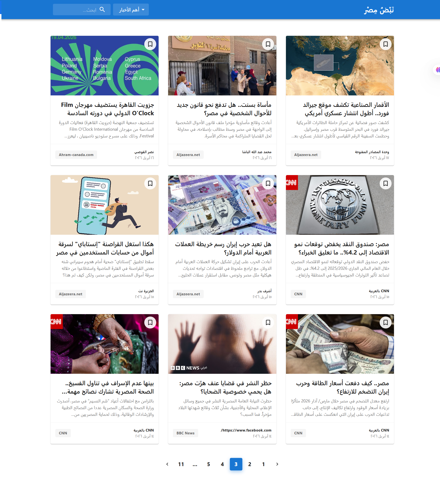
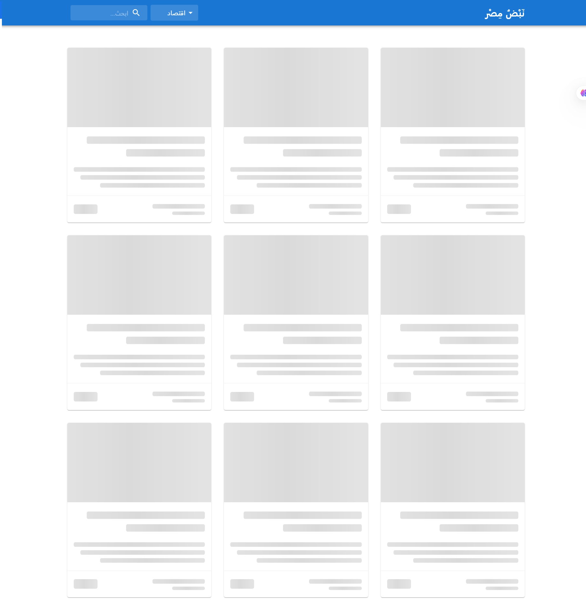
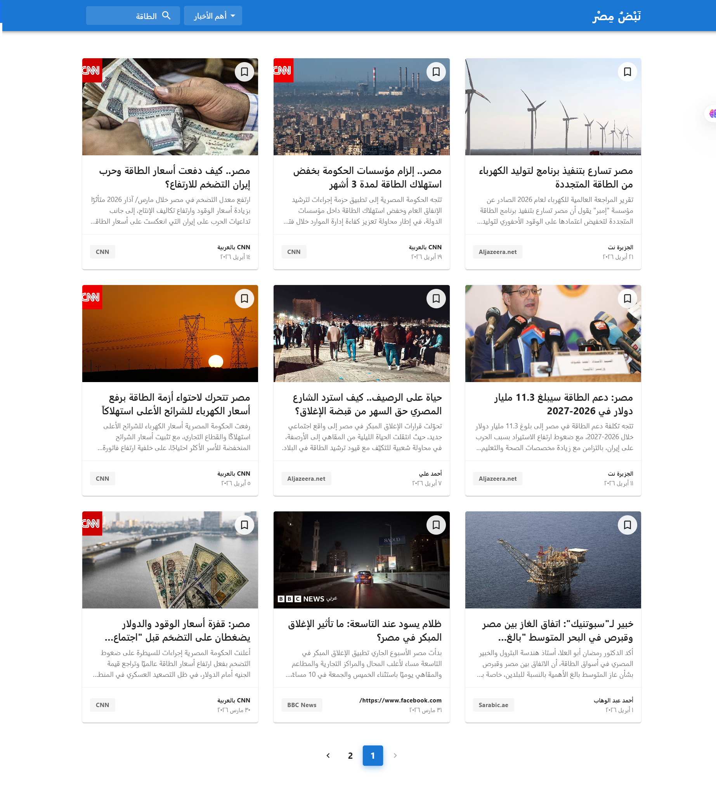

<div align="center">
  <h1>📰 Nabd Masr (نبض مصر)</h1>
  <p><strong>A dynamic, highly optimized, and responsive Egypt News Feed application.</strong></p>

  <p>
    <a href="https://nabd-masr.netlify.app/" target="_blank">
      
    </a>
  </p>

  <p>
    <a href="https://github.com/N3ssar/nabd-masr/issues"></a>
    <a href="https://github.com/N3ssar/nabd-masr/stargazers"></a>
    <a href="https://github.com/N3ssar/nabd-masr/network/members"></a>
  </p>
</div>

---

## 📖 About The Project

**Nabd Masr (نبض مصر)** is a modern frontend web application designed to deliver the latest and most important news in Egypt. Built to demonstrate clean architecture and advanced API handling, it focuses on performance, type safety, and providing a flawless user experience using Google's Material Design principles.

Whether you're browsing general top headlines, filtering by specific categories like Technology or Sports, or searching for a specific trending topic, the app ensures a blazing-fast, visually pleasing, and highly stable journey.

---

## 📸 Project Previews

<div align="center">
  <h3>🏠 Landing Page (Category Filtering)</h3>
  
  
  <br><br>

  <h3>⏳ Loading State (Skeleton UI)</h3>
  

<br><br>

  <h3>🔍 Search Results</h3>
  
</div>

---

## ✨ Key Features

- **🚀 Advanced Tech Stack:** Built with React and TypeScript for maximum type safety, powered by Vite for lightning-fast bundling.
- **🎨 Material UI Integration:** A sleek, user-friendly, and fully responsive interface powered by MUI components with custom thematic styling.
- **🧠 Smart Search & Filtering:** Implemented a hybrid search logic to accurately filter Arabic news by category and custom user queries simultaneously.
- **📑 Seamless Pagination:** Smooth navigation through hundreds of articles with automatic top-scroll behavior and dynamic state handling.
- **🛡️ Robust Error Boundaries:** Custom, user-friendly UI states for Network failures, API Rate Limits (429), and Upgrade Requirements (426).

---

## ⚡ Performance & UX Optimizations

- **⏳ Perceived Performance:** Integrated `Skeleton` loading effects mirroring the article cards to eliminate Layout Shifts and improve the perceived loading time.
- **🛑 Request Debouncing:** Implemented a 500ms debounce on the search input to prevent unnecessary API calls and respect server rate limits.
- **🖼️ Fallback Image Handling:** Added elegant `onError` handlers to article images to seamlessly replace broken or CORS-blocked images with a high-quality fallback placeholder.
- **🎯 Pagination Guardrails:** Capped the maximum pagination limit to 99 articles to proactively prevent the NewsAPI "Developer Plan Limits" from crashing the UI on deeper pages.

---

## 🧠 Challenges Overcome

- **Bypassing Production API Restrictions:** Overcame NewsAPI's strict "localhost-only" policy on free tiers by wrapping API requests in a secure `corsproxy.io` middleware layer, ensuring the app runs flawlessly on the Netlify production domain.
- **Solving Server 500 Errors via Smart Queries:** The default NewsAPI `/top-headlines` endpoint often failed or returned empty arrays for specific Arabic categories. I engineered a **"Smart Query" strategy** using the `/everything` endpoint, utilizing specific boolean logic (e.g., `رياضة OR الأهلي OR الزمالك`) to force the server to return highly accurate and rich data sets without crashing.
- **Handling UI Library Quirks:** Resolved React event propagation warnings by utilizing `span` wrappers around disabled MUI `PaginationItem` components to ensure `Tooltip` functionality remains completely bug-free.

---

## 🛠️ Built With

- 
- 
- 
- 

---

## 🚀 Getting Started

To get a local copy up and running, follow these simple steps.

### Prerequisites

Make sure you have Node.js and npm installed on your machine.

- npm
  ```sh
  npm install npm@latest -g
  ```

````

### Installation

1.  Clone the repo
    ```sh
    git clone [https://github.com/N3ssar/nabd-masr.git](https://github.com/N3ssar/nabd-masr.git)
    ```
2.  Navigate to the project directory
    ```sh
    cd nabd-masr
    ```
3.  Install NPM packages
    ```sh
    npm install
    ```
4.  **Important:** Create a `.env` file in the root directory and add your NewsAPI key:
    ```env
    VITE_NEWS_API_KEY=your_api_key_here
    ```
5.  Start the development server
    ```sh
    npm run dev
    ```

-----
````
## 👨‍💻 Author

**Muhammad Nassar**

  - GitHub: [@N3ssar](https://www.google.com/search?q=https://github.com/N3ssar)
  - LinkedIn: [Muhammad Ahmad Nassar](https://www.linkedin.com/in/mohamed-nassar-5a419a244/)

If you find this project useful or learned something from the code, please consider giving it a ⭐\!
